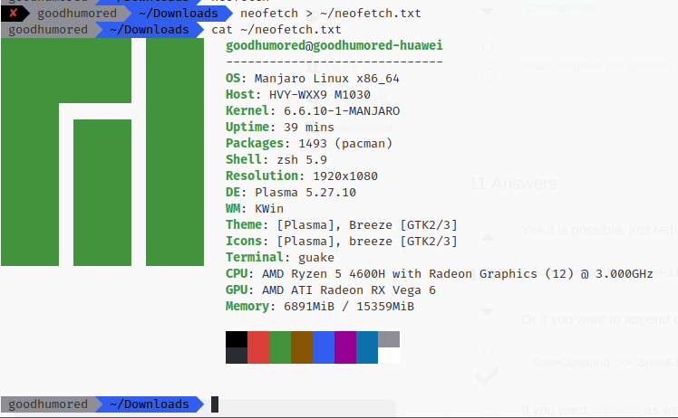

# Меню пуск

В меню пуск представлены и сгруппированы некоторые основные приложения, установленные в системе, там лежат приложения для работы с файлами, стандартный браузер, стандартный файловый менеджер и прочее.

# Стандартная информация о системе

Стандартная информация о системе была получена вызовом команды neofetch.

Результат был сохранён в домашнюю директорию.

# Файловый менеджер

Стандартный файловый менеджер в данной системе - Dolphin

Режим отображения скрытых файлов переключается горячей клавишей ctrl+H

Помимо графического файлового менеджера в системе присутствует Midnight Commander, доступный в терминале

