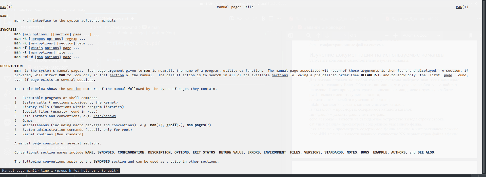
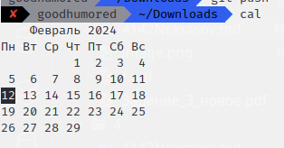

# man

man - команда для отображения мануала по команде

# cal

cal - команда для отображения календаря

# Частые команды

* pwd – вывод имени текущего каталога; 
* cd <каталог> - перейти в указанный каталог; 
* mkdir <каталог> - создать каталог с именем каталог. 
* ls <каталог> – просмореть содержимое каталога каталог. 
* rm <файл> – удалить файл с именем файл. 
* echo <строка>– вывести на стандартное устройство вывода строку строка. 
* cat <имя файла>- просмотреть содержимое указанного файла. 
* less <файл> - просмотреть содержимое файла <файл> в интерактивном режиме.
* head -NN <файл>– вывести заданное количество NN первых строк файла <файл>.

