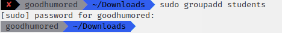
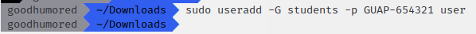
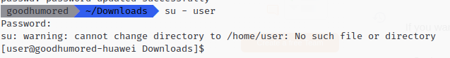
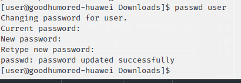
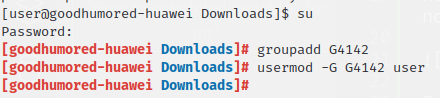
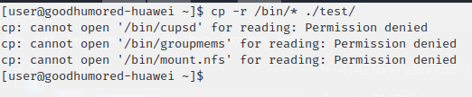
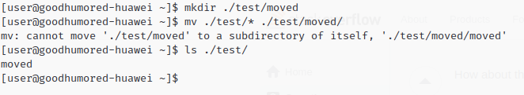
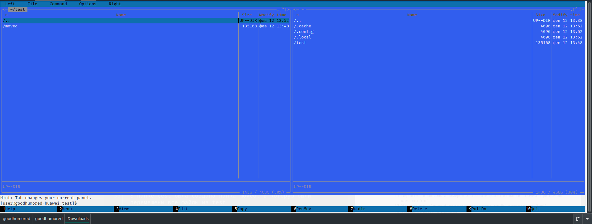
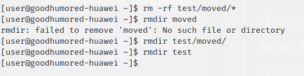

# Цель работы:

Знакомство с командами по управлению пользователями и группами, изучение основных команд в POSIX системах для работы с каталогами и файлами. Приобретение навыков работы с учетными записями и с файлами  в  POSIX системах из командной строки.

# Выполнение работы

Для начала была создана группа Students

Затем был создан пользователь user, добавленный в группу students

После этого можно было авторизоваться за этого пользователя

Далее был изменён пароль на GUAP-123456

Затем через суперпользователя была создана группа G4142 и туда был перенесён пользователь user

В домашней директории юзера была создана папка test, в которую было скопировано содержимое папки /bin

В папке test была создана папка moved, в которую были перемещены все файлы из test

Затем все файлы были удалены

