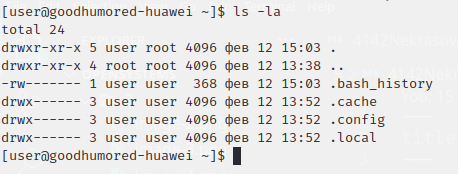
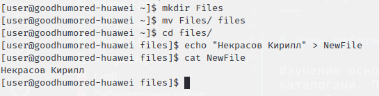
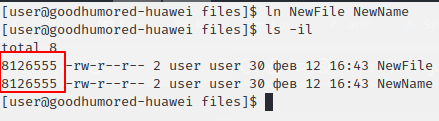
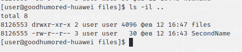
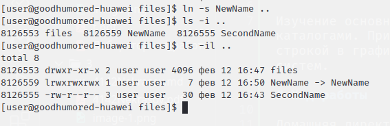

# Цель работы

Изучение основных команд для работы с файлами и каталогами. Приобретение навыков работы с командной строкой в графическом и консольном интерфейсах POSIX систем.

# Ход работы

Домашняя директория

Создана папка files, в которой был создан файл NewFile с фамилией и именем

Была создана ссылка на файл NewFile с именем NewName

Была создана ссылка на файл NewFile с именем SecondName в домашней директории

Была создана мягкая ссылка на файл NewName в домашней директории

